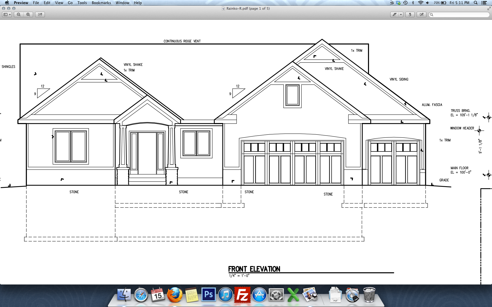

# AutoCAD

This repository contains the drawings made in AutoCAD as a part of Engineering Graphics course.

The team members were:

1. Ajinkya Bedekar

2. Ashish Kumar

3. Shubhdeep Ghosh

It contains the following:

1. AutoCAD drawings

2. Images of some demo drawings

A user can download and install the latest version of AutoCAD and open the DWG files through it.

Some demo drawings:

